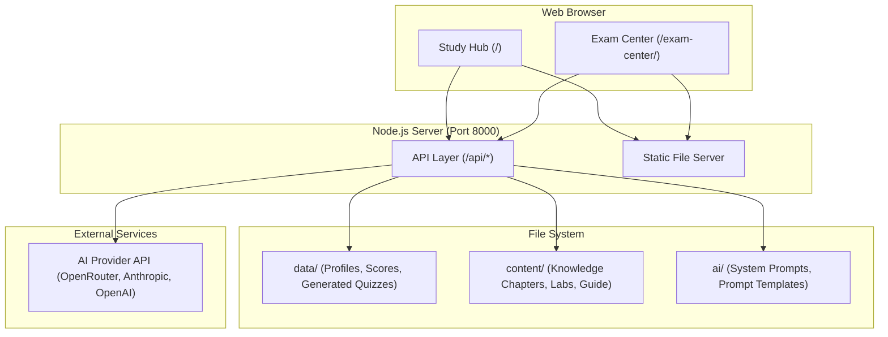

# Claude Certified Architect — Foundations

An interactive, self-hosted study and exam preparation portal for the **Claude Certified Architect — Foundations** certification.

---

## Quick Start

```bash
# 1. Install Node.js (v18+ recommended) — https://nodejs.org/
# 2. Launch the platform:
scripts\start.bat          # Windows — opens interactive launcher menu
# — or —
node app/server.js         # Direct start (all platforms)
```

Once running, open your browser:

| Portal | URL |
|--------|-----|
| **Study Hub** | [http://localhost:8000](http://localhost:8000) |
| **Exam Center** | [http://localhost:8000/exam-center](http://localhost:8000/exam-center) |

---

## Project Structure

```
Claude Certs/
│
├── app/                          # Web application code
│   ├── server.js                 # Unified Node.js server (no npm deps)
│   ├── config/                   # AI provider catalog (no secrets)
│   │   └── ai_providers.js
│   ├── shared/                   # Client code shared by both portals
│   │   └── ai-config.js          # AI provider config module (/shared/ai-config.js)
│   ├── portals/                  # Frontend portals
│   │   ├── study-hub/            # Study Hub portal (HTML/CSS/JS)
│   │   │   ├── index.html
│   │   │   └── assets/
│   │   └── exam-center/          # Exam Center portal (HTML/CSS/JS)
│   │       ├── index.html
│   │       ├── assets/
│   │       └── data/             # Static quiz & mock data (loaded client-side)
│   │           ├── manifest.js
│   │           ├── quiz_domain*.js
│   │           └── mocks/
│   └── tests/                    # Automated test scripts
│       ├── smoke.js              # API smoke tests
│       └── verify-content.js     # Markdown rendering tests
│
├── content/                      # Study material & knowledge base
│   ├── Exam_Guide.md             # Full exam preparation guide
│   ├── context/                  # Exam overview, study plan, progress tracker
│   ├── knowledge/                # Domain chapters (00–05) + Glossary
│   ├── labs/                     # Hands-on lab exercises
│   └── resources/                # Reference links
│
├── ai/                           # AI configuration & prompts
│   ├── AI_System_Prompt.md       # System prompt for AI tutors
│   ├── Handoff_Instructions.md   # Handoff guide for AI context
│   └── prompts/                  # Prompt templates for chat workflows
│
├── data/                         # Runtime data (user profiles, scores)
│   ├── syllabus.json             # Syllabus definition (5 domains, 30 modules)
│   ├── profiles.json             # User profile store
│   ├── scores.json               # Quiz/mock score history
│   ├── generated/                # AI-generated question sets
│   └── users/                    # Per-user data (progress, sessions, content,
│                                 #   ai-config.json = saved AI provider + key)
│
├── infra/                        # Infrastructure & deployment
│   ├── caddy.exe                 # Caddy reverse proxy binary
│   ├── Caddyfile                 # Caddy configuration
│   ├── domain.txt                # Configured domain name
│   └── DEPLOYMENT_GUIDE.md       # Step-by-step deployment instructions
│
├── scripts/                      # Launch & management scripts
│   ├── start.bat                 # Main interactive launcher (menu: Local / Public HTTPS / Architecture)
│   ├── start-dashboard.bat       # Alias → start.bat (Study Hub)
│   ├── start-exam-center.bat     # Alias → start.bat (Exam Center)
│   ├── start-hidden.ps1          # PowerShell: starts Node + Caddy hidden (requires -Root param)
│   ├── start-headless.ps1        # PowerShell: starts Node + Caddy hidden, no PID tracking
│   ├── start-public-hidden.bat   # Batch: kills existing, writes Caddyfile for claude-cert.linkpc.net, starts both hidden
│   ├── stop-server.bat           # Stops servers using hidden_pids.json + fallback process kill
│   ├── hidden_pids.json          # PID tracking file (created by start-hidden.ps1 / start-public-hidden.bat)
│   ├── start-minimized.bat       # Starts servers in minimized windows
│   ├── process_badges.ps1        # Badge/image processing utility
│   └── generate_favicons.ps1     # Favicon generation utility
│
├── README.md                     # ← You are here
└── .hintrc                       # Editor hints
```

---

## Scripts Reference (`scripts/`)

| Script | Type | Purpose | Usage |
|--------|------|---------|-------|
| `start.bat` | Batch | **Main interactive launcher** — presents menu: [1] Local Mode (localhost:8000), [2] Public HTTPS (custom domain + auto TLS), [3] Architecture Diagram, [4] Exit | `scripts\start.bat` |
| `start-dashboard.bat` | Batch | Shortcut → launches `start.bat` (opens Study Hub) | `scripts\start-dashboard.bat` |
| `start-exam-center.bat` | Batch | Shortcut → launches `start.bat` (opens Exam Center) | `scripts\start-exam-center.bat` |
| `start-public-hidden.bat` | Batch | **Production restart** — kills existing Node/Caddy, writes Caddyfile for `claude-cert.linkpc.net`, starts both **hidden** (no visible windows), saves PIDs | Double-click or `scripts\start-public-hidden.bat` |
| `start-hidden.ps1` | PowerShell | Starts Node + Caddy hidden with PID tracking (requires `-Root` parameter) | `powershell -File scripts\start-hidden.ps1 -Root "C:\path\to\project"` |
| `start-headless.ps1` | PowerShell | Starts Node + Caddy hidden, no PID tracking (requires `-Root` parameter) | `powershell -File scripts\start-headless.ps1 -Root "C:\path\to\project"` |
| `start-minimized.bat` | Batch | Starts servers in minimized CMD windows | `scripts\start-minimized.bat` |
| `stop-server.bat` | Batch | **Graceful shutdown** — reads `hidden_pids.json`, kills tracked PIDs, falls back to killing any `server.js` or `caddy.exe` processes | `scripts\stop-server.bat` |
| `hidden_pids.json` | JSON | PID tracking file (auto-generated by hidden launch scripts) | Not run directly |
| `process_badges.ps1` | PowerShell | Badge/image processing utility | Internal use |
| `generate_favicons.ps1` | PowerShell | Favicon generation utility | Internal use |

### Common Workflows

**Quick Local Development:**
```cmd
scripts\start.bat
# Select [1] Local Mode → http://localhost:8000
```

**Production Restart After Reboot (Hidden, HTTPS):**
```cmd
scripts\start-public-hidden.bat
# Starts https://claude-cert.linkpc.net/ and https://claude-cert.linkpc.net/exam-center/
```

**Stop All Servers:**
```cmd
scripts\stop-server.bat
```

**Direct Node Start (No Launcher):**
```cmd
node app/server.js
# Study Hub: http://localhost:8000/
# Exam Center: http://localhost:8000/exam-center/
```

---

## Architecture



```text
                  +----------------------------------+
                  |           Web Browser            |
                  |  Study Hub (/) | Exam Center (/exam-center/) |
                  +-----------------+----------------+
                                    |
                                    v
                  +----------------------------------+
                  |      Node.js Server (:8000)      |
                  |  - Static Assets (/ & /exam-center/)
                  |  - JSON API (/api/*)             |
                  +-----------------+----------------+
                                    |
            +-----------------------+-----------------------+
            |                       |                       |
            v                       v                       v
    +---------------+       +---------------+       +---------------+
    |  data/        |       |  content/     |       |  External AI  |
    |  - profiles   |       |  - knowledge  |       |  - OpenRouter |
    |  - scores     |       |  - labs       |       |  - Anthropic  |
    |  - generated  |       |  - guide      |       |  - OpenAI     |
    +---------------+       +---------------+       +---------------+
```

---

## Portals

### 📖 Study Hub (`/`)

The primary learning interface:
- **Interactive syllabus** with 5 domains and 30 modules
- **AI-powered content generation** — modules are written on-demand by AI tutors
- **Nyx AI Chat** — study coach for Q&A and exam preparation
- **Progress tracking** — per-module completion status
- **Hands-on labs** — practical exercises with step-by-step checkoffs

### 📋 Exam Center (`/exam-center/`)

The exam simulation and testing interface:
- **Section quizzes** — domain-specific question sets (5 domains)
- **Full mock exams** — timed, exam-weight simulations
- **AI-generated question sets** — scenario-based questions generated on demand
- **Score tracking** — historical performance and analytics
- **Sage AI Chat** — exam-focused AI tutor

---

## AI Integration

Both portals share one AI provider configuration:

1. Click **⚡ AI Provider** in the topbar (or the ⚙️ gear in the chat window)
2. Select a provider — the model dropdown auto-populates from that provider
3. Paste your API key and pick a model, then Save

The selection is stored server-side under your profile
(`data/users/<slug>/ai-config.json`), so it survives a refresh, applies to
both Study Hub and Exam Center, and is never shared with another user
signing in on the same browser. The API key stays on the server and is
never sent back to the browser. The provider catalog in
`app/config/ai_providers.js` contains no secrets.

AI features include:
- **Chat tutoring** (Nyx in Study Hub, Sage in Exam Center)
- **Knowledge generation** — AI writes domain chapter content
- **Scenario-based question generation** — creates exam-realistic quizzes and mocks
- **Performance summaries** in the Exam Center

---

## Deployment Options

### 1. Local Mode (Default)

Simply run `scripts\start.bat` and select **[1] Local Mode**.

### 2. Public Internet Mode (Custom Domain + Auto HTTPS)

Expose the portals over the internet with automated Let's Encrypt SSL:

1. Register a domain (e.g., at [freedomain.one](https://freedomain.one), DuckDNS, Cloudflare)
2. Point the DNS A-Record to your server's public IP
3. Open inbound ports **80** and **443** in your firewall/NSG
4. Run `scripts\start.bat` and select **[2] Public Internet Mode**
5. Caddy handles TLS certificate acquisition and renewal automatically

See [`infra/DEPLOYMENT_GUIDE.md`](infra/DEPLOYMENT_GUIDE.md) for detailed instructions.

---

## Running Tests

```bash
# API smoke tests (requires running server)
node app/tests/smoke.js http://localhost:8000

# Markdown rendering unit tests
node app/tests/verify-content.js
```

---

## Tech Stack

- **Server**: Node.js (zero npm dependencies — uses only built-in modules)
- **Frontend**: Vanilla HTML, CSS, JavaScript
- **Reverse Proxy**: [Caddy](https://caddyserver.com) (auto-HTTPS via Let's Encrypt)
- **Data Storage**: JSON files on disk (no database required)

---

## Content Domains

| # | Domain | Modules |
|---|--------|---------|
| 1 | Agentic Architecture & Orchestration | 6 |
| 2 | Claude Code Configuration & Workflows | 6 |
| 3 | Prompt Engineering & Structured Output | 6 |
| 4 | Tool Design & MCP Integration | 6 |
| 5 | Context Management & Reliability | 6 |

