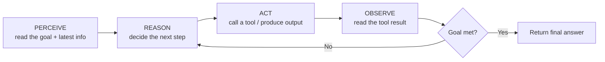
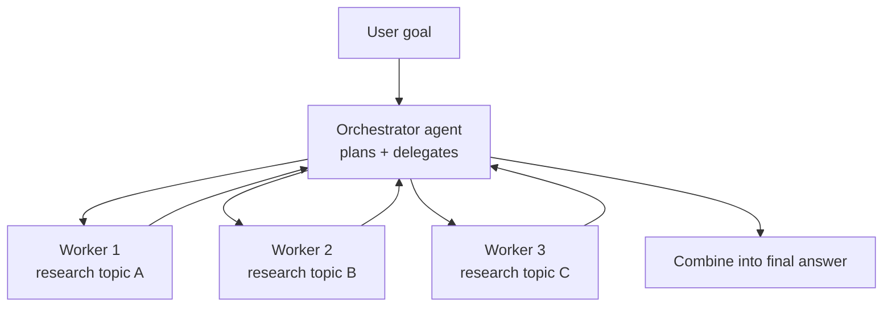

# 01 — Agentic Architecture and Orchestration

> **Exam weight: 27% (the biggest domain — study this hardest).**
> **Audience:** You are a senior cybersecurity engineer who is brand new to AI. Every term is defined the first time it appears, with a security analogy where it helps.

---

## 0. Words you need before we start

- **LLM (Large Language Model):** a program (like Claude) trained to predict text. You give it words, it gives you words back. Think of it as an extremely well-read assistant that has read most of the public internet but has **no memory** of your past chats unless you re-send them.
- **Prompt:** the text instruction you send to the model. Like a query you type into a tool.
- **Token:** the small chunk of text the model reads/writes (roughly ¾ of a word). Models are billed and limited by tokens — like how logs are measured in events, not "stories."
- **Inference / a call:** one round-trip request to the model. One prompt in, one answer out.

---

## 1. What is an AI agent (vs a single-shot prompt)?

**Single-shot prompt** = you ask **once**, you get **one** answer, and you're done.

```
You ──prompt──▶ [ LLM ] ──answer──▶ You     (one and done)
```

Example: *"Summarize this incident report in 3 bullets."* → one answer. Perfect for single-shot.

**AI agent** = the LLM is put in a **loop** and given **tools** (things it can *do*, not just say), so it can take several steps on its own to reach a goal.

> **Security analogy:** A single-shot prompt is like running one command and reading the output. An agent is like a **SOAR playbook** (Security Orchestration, Automation and Response): it looks at an alert, decides what to check next, runs a lookup, sees the result, decides the next action, and keeps going until the incident is handled.

**Definition — Agent:** a system where an LLM **decides what to do next**, can **use tools**, and **keeps looping** using the results of its own actions until the task is finished.

**Definition — Tool:** a function the agent is allowed to call to affect the outside world or fetch fresh data — e.g. "search the web," "read a file," "query a database." (Deep dive in file 04.)

---

## 2. The agent loop: Perceive → Reason → Act → Observe

The heart of every agent is a repeating cycle:



Plain ASCII version:

```
        +-----------+
        | PERCEIVE  |  read goal + newest data
        +-----------+
              |
              v
        +-----------+
        |  REASON   |  "what should I do next?"
        +-----------+
              |
              v
        +-----------+
        |   ACT     |  call a tool or write output
        +-----------+
              |
              v
        +-----------+
        | OBSERVE   |  look at the result
        +-----------+
              |
       goal met? --no--> back to REASON
              |
             yes
              v
          FINISH
```

- **Perceive:** take in the goal and any new information (the user request, a tool result).
- **Reason:** the LLM thinks about the next step. ("I need the user's account status first.")
- **Act:** it calls a tool or writes something. ("Call `getAccount(id)`.")
- **Observe:** it reads what came back. ("Account is locked.")
- Then it loops until the goal is done.

> **Security analogy:** this is the OODA loop (Observe–Orient–Decide–Act) that incident responders use. Same idea: sense, think, do, sense again.

### 2.1 What actually controls the loop: `stop_reason`  ⭐ exam favorite

The loop above is a *concept*. In real code (like the Anthropic API and the Agent SDK) the thing that decides "loop again or stop?" is a field on every model response called **`stop_reason`**.

- **`stop_reason: "tool_use"`** → the model wants to call one or more tools. Your loop **runs those tools, appends the tool results to the conversation history, and calls the model again.** The model now "sees" what happened and reasons about the next action.
- **`stop_reason: "end_turn"`** → the model is finished and produced its final answer. Your loop **terminates.**

```
call model
  ├─ stop_reason == "tool_use"  → run tools → append results to history → call model again (loop)
  └─ stop_reason == "end_turn"  → done, return the final answer
```

> **Definition — conversation history:** the running transcript (user message, assistant messages, and tool results) that you re-send on every call. The model has no memory of its own; each iteration you **append the latest tool results** so it can reason about the next step. Think of it as the case file that grows with every action the responder takes.

> **Security analogy:** `stop_reason` is the machine-readable exit code of a step in your SOAR playbook. You branch on the exit code — you do **not** grep the human-readable log text to guess whether the step "seemed done."

**Model-driven vs pre-configured decision trees.** In an agent, the *model* decides each next action from the live results (model-driven). In a workflow, *you* wired the path in advance (a pre-configured decision tree). Knowing which one you have tells you who is in control of the loop.

**Anti-patterns — how people break loop control (all tested):**
- ❌ **Parsing natural-language signals** ("looks like I'm done", "final answer:") to decide when to stop. Fragile — the model's wording changes. Use `stop_reason` instead.
- ❌ **Using an arbitrary iteration cap as the *primary* stopping mechanism.** A max-iterations cap is a *safety net* against runaway loops, not the real signal for "task complete." Terminate on `end_turn`; keep the cap only as a backstop.
- ❌ **Checking for assistant text content as a completion indicator.** A response can contain text *and still* have `stop_reason: "tool_use"` (the model narrates, then calls a tool). Text present ≠ finished.

---

## 3. When to choose agentic vs single-shot

This is a favorite exam theme. The rule of thumb:

> **Start simple. Use the simplest thing that works. Add agentic complexity only when the task genuinely needs it.**

| Question | If **YES** → lean agentic | If **NO** → single-shot is fine |
|---|---|---|
| Are the steps unknown until you see intermediate results? | ✅ | |
| Does it need to use tools / fetch live data / act in the world? | ✅ | |
| Is the path different every time (open-ended)? | ✅ | |
| Is it one clear transformation (summarize, translate, classify)? | | ✅ |
| Do you need it fast, cheap, and 100% predictable? | | ✅ |

### Tradeoffs (memorize these three axes)

- **Cost:** each loop = more model calls = more tokens = more money. An agent can make 5–50 calls for one task; a single-shot makes 1.
- **Latency (delay):** more steps = slower. A single-shot answers in seconds; an agent may take minutes.
- **Reliability / predictability:** more autonomy = more places to go wrong. Single-shot is boringly predictable; agents can loop, wander, or misuse a tool.

> **Security analogy:** full automation is powerful but risky. You wouldn't auto-remediate every alert; you automate the well-understood, high-volume tasks and keep a human on the ambiguous ones. Same trade-off here.

**One-line answer for the exam:** *Prefer single-shot / simple chains for predictable tasks; use an agent only when the task is open-ended and needs tools or multi-step reasoning, accepting higher cost and latency for that flexibility.*

---

## 4. Orchestration patterns

**Definition — Orchestration:** how you arrange one or more LLM calls (and agents) to get work done. Below are the standard patterns, from simplest to most autonomous. **The first ones are "workflows" (fixed paths you design); the last is a true "agent" (the model chooses the path).**

### 4.1 Single agent
One LLM in one loop with a set of tools. Simplest agent. Good default.

### 4.2 Prompt chaining
Break a task into fixed steps; the output of step 1 feeds step 2, etc. **You** decide the order, so it's predictable.

```
[Draft] -> [Check facts] -> [Rewrite in plain English] -> Done
```
> Analogy: a fixed runbook where each stage hands off to the next.

### 4.3 Routing
A first LLM call **classifies** the request and sends it to the right specialized handler.

```
Request --> [Router] --+--> billing prompt
                       +--> tech-support prompt
                       +--> security prompt
```
> Analogy: a SIEM rule that tags an alert and routes it to the correct queue.

### 4.4 Parallelization
Run several calls **at the same time**, then combine. Two flavors:
- **Sectioning:** split work into independent parts done in parallel (e.g., scan 5 files at once).
- **Voting:** ask the same question several times and take the majority answer (more reliable).

```
        +--> worker A --+
Task ---+--> worker B --+--> combine --> answer
        +--> worker C --+
```

### 4.5 Orchestrator–worker (subagents)  ⭐ know this well
A lead LLM (the **orchestrator**) breaks a big task into pieces and hands each piece to a **worker/subagent**. Workers run (often in parallel), return results, and the orchestrator assembles the final answer.

**Definition — Subagent:** a separate agent, with its own focused prompt and its own context, spawned to do one sub-task. It keeps the main agent's context clean.



ASCII version:

```
                +------------------+
   goal  -----> |   ORCHESTRATOR   |  plans & splits the work
                +------------------+
                 |       |       |
                 v       v       v
            +-------+ +-------+ +-------+
            |Worker1| |Worker2| |Worker3|   each does one sub-task
            +-------+ +-------+ +-------+
                 |       |       |
                 +-------+-------+
                         v
                +------------------+
                |   ORCHESTRATOR   |  merges results -> final answer
                +------------------+
```

> **Security analogy:** the orchestrator is the incident commander; the workers are specialists (network, endpoint, identity). The commander delegates, collects findings, and writes the report.

#### 4.5a Coordinator–subagent (hub-and-spoke), in detail  ⭐ know this well

The orchestrator–worker pattern is often built as a **coordinator–subagent (hub-and-spoke)** system, and the exam expects you to know exactly who does what.

- The **coordinator** is the hub. It owns **all inter-subagent communication, error handling, and routing** — subagents do **not** talk to each other directly, they talk *through* the coordinator.
- The coordinator does **task decomposition, delegation, and result aggregation**.
- The coordinator **dynamically decides *which* subagents to invoke** based on how complex the query is. **Do not always route every request through the full pipeline** — a simple question might need one subagent; a broad one needs several.

> **Security analogy:** hub-and-spoke is the incident-commander model. Specialists report to the commander, never freelance to each other; the commander decides which specialists are even needed for *this* incident and pulls in more only if gaps appear.

**Isolated context (this is the trap):** each subagent runs with its **own ISOLATED context.** A subagent does **NOT** automatically inherit the coordinator's conversation history. If the subagent needs a prior finding, the coordinator must **explicitly put it in the subagent's prompt** (see 4.5b).

**Risk — overly narrow decomposition.** If the coordinator slices the task too thinly, no single subagent covers the *broad* parts of the question and you get **incomplete coverage**. Mitigate with an **iterative refinement loop:**

```
coordinator delegates → subagents return findings → coordinator SYNTHESIZES
    → coordinator evaluates the synthesis for GAPS
        ├─ gaps found → re-delegate with targeted queries → re-run synthesis
        └─ coverage sufficient → return final answer
```

> Analogy: the commander reads the draft report, spots "we never checked identity logs," sends one specialist back with a specific ask, and re-writes the report — repeating until nothing important is missing.

#### 4.5b Spawning subagents and passing context (the `Task` tool)  ⭐

*How* does a coordinator create a subagent in the Agent SDK? Through a tool.

- The **`Task` tool** is the mechanism to **spawn a subagent.** For the coordinator to use it, its **`allowedTools` must include `"Task"`** — no `Task` in the allow-list, no subagents.
- **Context must be passed EXPLICITLY in the prompt.** Because subagent context is isolated, the coordinator includes the **complete findings from prior agents** in the spawning prompt. Nothing is inherited for free.
- **Use structured data formats** (e.g., JSON) to **separate content from metadata** — keep source URLs, document names, and page numbers as distinct fields so **attribution is preserved** and not blended into prose.
- **Spawn PARALLEL subagents by emitting multiple `Task` tool calls in a single coordinator response.** (One response, several `Task` calls = they run at the same time.)
- **`AgentDefinition`** is the per-subagent config: its **description, system prompt, and tool restrictions.** This is where you give each subagent a focused role and limit what it can touch.
- **Write coordinator prompts as goals + quality criteria, not step-by-step procedures.** Tell a subagent *what "good" looks like* ("find the 3 highest-impact issues with sources"), not a rigid click-by-click script — the model plans the steps.

> **Security analogy:** `Task` is the ticket you file to pull in a specialist; `allowedTools` is whether you even have permission to open that ticket; `AgentDefinition` is the specialist's role card and access scope (least privilege). You hand them the case facts explicitly because they weren't in the room for the earlier calls.

### 4.6 Multi-agent
More than one agent working together, sometimes as peers, sometimes debating or reviewing each other. Orchestrator–worker is one *kind* of multi-agent setup.

### 4.7 Evaluator–optimizer (generator + critic)
One LLM **produces** an answer; a second LLM **grades/critiques** it; the first **revises**. Loop until good enough.

```
[Generator] --draft--> [Evaluator] --feedback--> [Generator] --> ... --> good answer
```
> Analogy: a pen-tester (generator) and a reviewer (evaluator) iterating until the report passes QA.

---

## 5. Planning and task decomposition

**Definition — Task decomposition:** breaking a big goal into smaller, doable steps.
**Definition — Planning:** having the model lay out those steps *before* acting.

- **Explicit plan first:** ask the agent to write the plan, then execute it. Easier to review and safer.
- **Plan-as-you-go:** the agent decides the next step each loop based on what it just observed. More flexible, harder to predict.

> Analogy: writing the incident-response plan up front vs. improvising step-by-step during a live incident. Up-front planning is auditable; improvising is adaptable.

### 5.1 Two decomposition strategies — fixed vs dynamic  ⭐

The exam wants you to pick the right decomposition strategy for the task.

**Fixed sequential pipeline (prompt chaining):** you pre-wire the stages in a set order. Best when the work is **predictable and multi-aspect** — e.g., a code review where you **analyze each file individually first, then run a separate cross-file integration pass.** Doing each file on its own **avoids attention dilution** (cramming ten files into one prompt makes the model spread its focus thin and miss details); the final integration pass then catches issues that only appear *across* files.

```
[review file A] [review file B] [review file C]  → [cross-file integration pass] → report
```

**Dynamic adaptive decomposition:** the plan **changes based on intermediate findings.** Best for **open-ended investigation** — e.g., **map the structure → identify the high-impact areas → build a prioritized plan that adapts as dependencies are discovered.** You don't know the full step list up front because each finding reshapes what to do next.

```
map structure → find high-impact areas → prioritized plan (re-orders itself as new dependencies surface)
```

> **Security analogy:** the fixed pipeline is a compliance checklist audit — same steps every time, in order. Dynamic decomposition is a live threat hunt — where you look next depends on what the last query turned up.

> **Watch the risk from 4.5a:** decomposing *too* narrowly can miss the broad picture. Pair dynamic decomposition with the coordinator's gap-check / iterative-refinement loop so nothing important is skipped.

---

## 6. Human-in-the-loop and guardrails

**Definition — Human-in-the-loop (HITL):** a checkpoint where a person must approve or correct the agent before it continues (especially before risky actions).

**Definition — Guardrail:** a rule or filter that limits what the agent is allowed to do or say.

Common guardrails:
- **Approval gates:** agent must ask before deleting data, spending money, sending email, running a command.
- **Allow-lists / least privilege:** the agent can only call a small, safe set of tools with limited scope.
- **Input/output validation:** check that inputs and outputs match an expected format before trusting them.
- **Limits:** max number of loops, max tokens, max cost, timeouts.

> **Security analogy:** this is straight out of your world — **least privilege**, change-approval workflows, and "break-glass with a human sign-off" for dangerous actions.

### 6.1 Enforcement vs guidance: programmatic vs prompt-based  ⭐

There are **two ways** to make an agent follow a rule, and the exam tests when to use which.

- **Prompt-based guidance:** you *tell* the model in its instructions ("always verify the customer's identity before issuing a refund"). This is easy but has a **non-zero failure rate** — the model *usually* complies, not *always*.
- **Programmatic enforcement:** you put the rule in **code** — a **prerequisite gate** or a **hook** — so it is **guaranteed**. The model literally cannot skip it.

> **When deterministic compliance is required (e.g., identity verification before a financial operation), prompt instructions alone are not enough.** Use programmatic enforcement.

**Prerequisite gates that BLOCK downstream tools.** Implement a rule that a tool call is **blocked until a prerequisite step completes.** Example: **block `process_refund` until `get_customer` has returned a *verified* ID.** The gate is enforced in code, not requested in a prompt.

```
process_refund called
  ├─ verified customer ID present?  ── no ──▶ BLOCK the call (must run get_customer first)
  └─ yes ──▶ allow the refund
```

> **Security analogy:** this is a hard access-control check, not a policy memo. You don't *ask* users to authenticate before touching prod — the system **refuses** the action until MFA passes. Same principle: gate the dangerous tool behind a verified prerequisite.

### 6.2 Structured handoff when escalating to a human

When an agent escalates to a person, remember: **the human does not have the conversation transcript.** So the agent must produce a **structured handoff summary** with everything the human needs to act — e.g., **customer ID, root cause, refund amount, and recommended action.**

> **Security analogy:** this is a clean SOC shift-handover / incident ticket. The next analyst wasn't watching your screen; they need the case ID, what happened, impact, and your recommended next step — not a raw chat log to reverse-engineer.

### 6.3 Agent SDK hooks — intercepting tools programmatically  ⭐

**Definition — Hook:** a piece of code the Agent SDK runs automatically at a specific point in the tool cycle, so you can inspect, transform, or block things **without relying on the prompt.** Hooks are the main mechanism for the *programmatic enforcement* described in 6.1.

Two hook types the exam cares about:

- **`PostToolUse` hooks — intercept tool RESULTS (incoming), for transformation/normalization *before the model sees them*.** Example: different tools return timestamps as Unix epoch, ISO 8601, or a numeric status code — a `PostToolUse` hook **normalizes them into one consistent format** so the model isn't confused by mismatched shapes.
- **Tool-call interception hooks — intercept OUTGOING tool calls, to enforce compliance.** Example: **block any refund above $500 and redirect it to human escalation** before the tool ever runs.

```
model → wants to call a tool → [tool-call interception hook]  → allow / block / redirect
tool runs → returns a result → [PostToolUse hook normalizes]  → model sees clean data
```

> **Choose hooks over prompts when business rules require GUARANTEED compliance** (money limits, identity checks, data redaction). Prompts *ask*; hooks *enforce*.

> **Security analogy:** a `PostToolUse` hook is a **log normalizer/parser** turning every device's weird timestamp into one schema before the SIEM ingests it. A tool-call interception hook is an **inline proxy/WAF** that blocks a disallowed outbound action regardless of what the client "intended."

---

## 7. Failure and retry handling

Agents fail in specific ways. Know the failure modes and the fixes.

| Failure mode | What it looks like | Mitigation |
|---|---|---|
| **Looping** | Agent repeats the same step forever | Cap max iterations; detect no-progress |
| **Tool error** | A tool returns an error/timeout | **Retry** (with a short backoff); try a fallback tool; surface the error to the model so it can adapt |
| **Hallucination** | Model invents facts/tool results | Ground it in real tool output; validate; ask it to cite (see file 05) |
| **Wrong path** | Agent pursues a bad plan | Evaluator step or human checkpoint |
| **Runaway cost** | Too many calls | Budget/step limits, cheaper model for simple sub-steps |

**Definition — Retry with backoff:** try again after a failure, waiting a little longer between attempts. (Same pattern as retrying a flaky API in your scripts.)

**Definition — Fallback:** a backup plan when the first thing fails (e.g., if the live search tool is down, use a cached copy).

---

## 8. Cost and latency considerations (bring it together)

Every design choice trades **capability** against **cost + latency + risk**:

- Fewer steps → cheaper, faster, safer, but less flexible.
- More steps / more agents → more capable, but slower, pricier, and more places to fail.
- **Parallelization** reduces *wall-clock latency* (things happen at once) but not total token *cost*.
- Use a **smaller/cheaper model** for easy sub-steps and a stronger model only where needed.

> **Free-tier note:** On the free tier you have limited usage. You can *learn and reason about* multi-agent designs (that's what the exam tests), but running large multi-agent systems yourself needs paid API access. For studying, focus on **understanding when and why** each pattern is used.

---

## 9. Session state: resuming and forking  ⭐

Long or multi-run agent work needs a way to **save and reuse** where you left off. The Agent SDK gives you named sessions.

**Definition — Session:** a saved, named conversation state you can come back to later, instead of starting from scratch.

- **Resume a named session** with **`--resume <session-name>`** — pick up an existing session and keep going where it stopped.
- **`fork_session`** creates an **independent branch from a shared baseline.** Both branches start from the same saved state, then diverge without stepping on each other — useful for exploring two approaches from one starting point.
- **Tell a resumed session what changed.** If files you analyzed earlier have since been edited, **inform the resumed session about those changes** so it does a **targeted re-analysis** of just the affected parts, instead of trusting stale conclusions.

```
baseline session ──resume──▶ continue same thread
                 └─fork_session─▶ branch A (try approach 1)
                                └▶ branch B (try approach 2)   ← independent, shared start
```

**When "start fresh" beats "resume."** Resuming replays the old conversation **including stale tool results** (an old file read, an outdated API response). If a lot has changed, those stale results can mislead the model. Sometimes it is **more reliable to start a new session and hand it a clean, structured summary** of the current state than to resume with outdated tool output baked into history.

> **Security analogy:** resuming a session is re-opening yesterday's investigation case file — fast, but some of the evidence (log snapshots, host state) may be stale, so you flag what changed for re-check. `fork_session` is cloning the case to run two parallel hypotheses from the same evidence baseline. And when the environment has shifted a lot, a fresh case with a crisp summary beats dragging along outdated notes.

---

## Verify latest
AI tooling changes fast. Before relying on specifics, check the official sources:
- **Anthropic "Building effective agents"** guidance (the source of the workflow-vs-agent patterns above).
- **Claude / Anthropic docs:** docs.anthropic.com and docs.claude.com.
Look especially for updated names of orchestration patterns and any new agent features.

---

## ✅ Check your understanding
When you're ready, tell your tutor AI you've finished this file. **It will ask you 5–10 multiple-choice questions, one at a time**, covering: single-shot vs agentic, the agent loop stages, `stop_reason`-based loop control and its anti-patterns, when to go agentic, each orchestration pattern (especially orchestrator–worker and the coordinator–subagent hub-and-spoke model, isolated context, the `Task` tool / `allowedTools` / `AgentDefinition`), fixed-vs-dynamic task decomposition, programmatic enforcement vs prompt guidance (prerequisite gates and Agent SDK hooks), structured human handoffs, session resume/fork, guardrails/HITL, and failure/retry handling. Answer one, get feedback, then move to the next.

Sample questions covering the newer material (your tutor may draw from these):

1. **An agent's model response comes back with `stop_reason: "tool_use"` and also contains a sentence of assistant text. What should the loop do?**
   - A. Stop, because the response contains final text.
   - B. Run the requested tool(s), append the results to the conversation history, and call the model again.
   - C. Parse the text to see whether it "sounds finished."
   - D. Stop only if the iteration cap has been reached.
   - *(Answer: B. Loop on `tool_use`; terminate on `end_turn`. Text present ≠ done, and parsing natural language or relying on an iteration cap as the primary stop signal are anti-patterns.)*

2. **In a coordinator–subagent (hub-and-spoke) system, a subagent needs a finding produced by an earlier subagent. How does it get it?**
   - A. It automatically inherits the coordinator's full conversation history.
   - B. It queries the other subagent directly.
   - C. The coordinator must include that finding explicitly in the subagent's spawning prompt.
   - D. It reads the coordinator's memory store by default.
   - *(Answer: C. Subagents run with isolated context; the coordinator (the hub) passes context explicitly and routes all inter-subagent communication.)*

3. **A workflow must NEVER issue a refund over $500 without human approval. Which approach guarantees compliance?**
   - A. A strong system-prompt instruction telling the model to escalate large refunds.
   - B. A tool-call interception hook that blocks refunds above $500 and redirects them to human escalation.
   - C. Asking the model to double-check the amount before calling the tool.
   - D. Lowering the model temperature.
   - *(Answer: B. Prompt guidance has a non-zero failure rate; programmatic enforcement via hooks/prerequisite gates gives guaranteed compliance.)*
