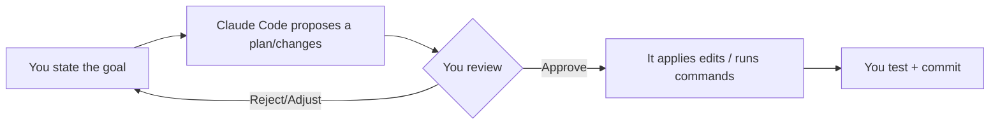

# 02 — Claude Code: Configuration and Workflows

> **Exam weight: 20%.**
> **Audience:** senior cybersecurity engineer, brand new to AI. Terms defined on first use; security analogies included.
> **Free-tier note up front:** Claude Code is a **paid** product (it runs on Claude API/subscription usage). On a free tier you generally **read about it and understand the concepts** for the exam rather than run it heavily. Sections that need paid access are marked **[PAID — read, don't run]**.

---

## 0. Quick vocabulary

- **CLI (Command-Line Interface):** a text-based program you run in a terminal. You already live here (PowerShell, bash).
- **IDE (Integrated Development Environment):** a code editor like VS Code.
- **Repo (repository):** a project folder tracked by version control (Git).
- **Agent:** an LLM in a loop that can use tools (see file 01).

---

## 1. What is Claude Code?

**Definition — Claude Code:** an **agentic coding tool** made by Anthropic that runs in your **terminal** (and integrates with IDEs). You describe a task in plain English; Claude Code reads your project, plans, edits files, runs commands, and shows you the changes — using the **agent loop** from file 01.

```
You (plain English)  ->  Claude Code  ->  reads files, edits code, runs commands
                                   ^                                   |
                                   +-------- observes results ---------+
```

> **Security analogy:** think of it as a very capable junior engineer who has terminal access to your repo. Enormously helpful — **and exactly why permissions and review matter** (covered below). You wouldn't give a new hire unreviewed `sudo` on day one.

**It is not** a chatbot in a browser tab. It's an agent **with hands** — it can change files and run tools on your machine.

---

## 2. Typical workflows

Common ways people use it:

1. **Explain a codebase:** *"What does this repo do? Where is auth handled?"* — great for onboarding to unfamiliar code.
2. **Make a change / add a feature:** *"Add input validation to the login endpoint."*
3. **Fix a bug:** paste an error; it finds and proposes a fix.
4. **Write tests:** *"Write unit tests for this module."*
5. **Refactor / clean up:** rename, reorganize, modernize.
6. **Git chores:** draft commit messages, help with pull requests.
7. **Answer questions about files/logs/configs.**

A healthy loop looks like:



> Best practice: **plan → review → apply → test**. Never blindly accept large changes.

---

## 3. The `CLAUDE.md` file — project memory / config

**Definition — `CLAUDE.md`:** a plain Markdown file you place in your project. Claude Code reads it automatically and treats it as **standing instructions / memory** for that project. It's how you tell the agent the rules once instead of every prompt.

Good things to put in `CLAUDE.md`:
- What the project is and its layout.
- Coding standards ("use TypeScript," "no `console.log` in prod").
- How to build/test/run ("run `npm test` before finishing").
- Things to **never** do ("never edit files under `/secrets`", "never commit to `main`").
- Useful commands and conventions.

```
my-project/
├── CLAUDE.md        <-- standing instructions Claude Code always reads
├── src/
└── tests/
```

> **Security analogy:** `CLAUDE.md` is like a **baseline hardening policy / group policy** for the assistant — the rules it always follows in this environment, so you don't repeat yourself and so behavior is consistent.

**Definition — Memory / project memory:** because the LLM itself is stateless (forgets between calls), `CLAUDE.md` gives it persistent context that survives across sessions.

### 3.1 The configuration hierarchy & scoping

`CLAUDE.md` (and related config) exists at **three scopes**, and *where* you put an instruction decides *who* gets it:

- **User-level** — `~/.claude/CLAUDE.md`. Applies to **only that one user**, on their machine, across **all** their projects. It is **personal** and is **NOT shared via version control** (it lives in your home directory, not the repo).
- **Project-level** — `.claude/CLAUDE.md` (or a `CLAUDE.md` at the repo root). Committed to the repo, so it is **shared with the whole team** and travels with the code.
- **Directory-level** — a `CLAUDE.md` placed inside a **subdirectory**. It applies **only when Claude is working within that subtree** — handy when one folder (e.g., `frontend/`) has different conventions than another (`backend/`).

More-specific scopes stack on top of broader ones (project + directory + user all contribute).

> **Definition — `@import` syntax:** inside a `CLAUDE.md` you can write `@path/to/file.md` to **pull in another file's contents**. This keeps `CLAUDE.md` **modular** — a short root file that imports `@.claude/rules/style.md`, `@docs/architecture.md`, etc., instead of one giant file.

> **Definition — `.claude/rules/` directory:** a folder of **topic-specific rule files** (e.g., `security.md`, `testing.md`). You keep each concern in its own file and reference them, rather than dumping everything into one `CLAUDE.md`.

> **Definition — `/memory` command:** a slash command that shows **which memory files are currently loaded** (user, project, directory, and any imports). Use it to verify Claude actually picked up the instructions you expect.

> **Security analogy:** the hierarchy is like **Group Policy scoping** — machine-wide vs OU-level vs per-user. Putting a control at the wrong scope means the wrong set of people get it.

> ⚠️ **The classic gap:** you add "always run `npm test` before finishing" to your **user-level** `~/.claude/CLAUDE.md`. It works great for you — but a **new teammate never receives it**, because user-level config isn't committed to the repo. The fix: put team-wide instructions in the **project-level** `.claude/CLAUDE.md` (or root `CLAUDE.md`) so version control shares them with everyone.

### 3.2 Path-specific rules (glob-scoped rules)

**Definition — path-specific rule:** a file in `.claude/rules/` with **YAML frontmatter** containing a `paths:` list of **glob patterns**. The rule loads **only when Claude is editing a file that matches** one of those patterns — so irrelevant guidance (and the tokens it costs) stays out of context the rest of the time.

```markdown
---
paths: ["terraform/**/*"]
---
Always pin provider versions. Never hard-code secrets in .tf files.
```

```markdown
---
paths: ["**/*.test.tsx"]
---
Use React Testing Library; one assertion group per behavior.
```

> **Definition — glob pattern:** a wildcard file-matching pattern. `**` matches any number of directories; `*` matches part of a filename. `terraform/**/*` = everything under `terraform/`; `**/*.test.tsx` = every `.test.tsx` file anywhere.

**Glob rules vs subdirectory `CLAUDE.md`:** a directory-level `CLAUDE.md` only fires inside **one folder**. But conventions often span **many** directories (all test files, all Terraform, wherever they live). A glob rule follows the **file type/pattern** regardless of location, so it's the better tool when a convention crosses directory boundaries.

> **Security analogy:** glob-scoped rules are like a **firewall rule keyed to a traffic signature** rather than to a single subnet — it applies wherever the matching pattern shows up.

---

## 4. Permissions and tool approval  ⭐ (your comfort zone)

Because Claude Code can edit files and run commands, it uses a **permission system**:

- By default it **asks for approval** before doing sensitive actions (running a command, editing outside scope, etc.).
- You can grant or deny each request, or pre-approve certain safe actions.
- You should scope its access to **only what the task needs**.

**Definition — Tool approval:** the checkpoint where *you* say yes/no before the agent performs an action. This is **human-in-the-loop** (file 01) applied to coding.

> **Security analogy:** this is **least privilege + change approval**. Grant the narrowest access, approve actions deliberately, and be extra careful with any "auto-approve everything" mode — that's the equivalent of disabling UAC/sudo prompts. Powerful, occasionally convenient, but risky.

**Rule of thumb:** review anything that (a) runs a command, (b) touches secrets/prod, or (c) makes large or irreversible changes.

---

## 5. Slash commands and custom commands (conceptual)

**Definition — Slash command:** a shortcut you type starting with `/` to trigger a built-in action (e.g., a command to clear the conversation, review, or manage config). They're quick controls for the tool itself, not part of your prompt to the model.

**Definition — Custom (custom slash) command:** a reusable prompt/workflow **you** define and save, then invoke by name — so a multi-step routine becomes one command.

> Example idea: a custom `/security-review` command that always tells Claude to check for injection, secrets in code, and missing input validation. Like saving a **playbook** you can run on demand.

*(You don't need to memorize exact command names for the concepts — know **what** slash commands and custom commands are and **why** they're useful. **[Running them: PAID — read, don't run]**)*

### 5.1 Where commands live: project vs user scope

Just like `CLAUDE.md`, custom commands have a **scope**:

- **Project-scoped** — `.claude/commands/`. Committed to the repo and **shared with the team via version control** — everyone gets the same `/security-review`.
- **User-scoped** — `~/.claude/commands/`. **Personal** commands available across all your projects, but **not shared** with teammates.

### 5.2 Skills

**Definition — Skill:** a reusable capability defined in `.claude/skills/` as a folder containing a **`SKILL.md`** file with **YAML frontmatter**. Unlike `CLAUDE.md` (which is *always* loaded), a skill is **loaded on demand** — Claude reaches for it only when the task calls for it. Useful frontmatter fields:

- **`context: fork`** — runs the skill in an **isolated sub-agent context**, so verbose/exploratory output doesn't clutter the main conversation (great for noisy discovery tasks).
- **`allowed-tools`** — **restricts** which tools the skill may use (least privilege for that skill).
- **`argument-hint`** — tells Claude to **prompt for parameters** the skill needs.

```markdown
---
name: db-migrate
context: fork
allowed-tools: [Read, Bash]
argument-hint: "which migration to run?"
---
Step-by-step migration playbook...
```

Skills also have a **personal variant** in `~/.claude/skills/` (available to just you, across projects).

> **Choosing skills vs `CLAUDE.md`:** put **always-relevant, universal standards** (coding style, "never commit to main") in `CLAUDE.md` so they're **always loaded**. Package **occasional, specialized procedures** as **skills** so they load **on demand** and don't burn context every session.

> **Security analogy:** a skill with `allowed-tools` + `context: fork` is like a **scoped service account running in its own sandbox** — narrow permissions, isolated blast radius.

---

## 6. Connecting MCP servers

**Definition — MCP (Model Context Protocol):** an **open standard** for connecting AI tools like Claude Code to external **tools and data sources** (databases, ticketing systems, cloud APIs, etc.). Full deep-dive is in **file 04**.

- Claude Code can act as an **MCP client** and connect to **MCP servers** you configure.
- This lets the agent do things beyond your local files — e.g., query a database or a service — through a standard "plug."

```
Claude Code (MCP client) ──plugs into──▶ [ MCP server: database ]
                          ──plugs into──▶ [ MCP server: tickets  ]
```

> **Security analogy:** MCP is a **standard connector**, like a universal API gateway. Every new connector is a new door — apply least privilege, review what each server can access, and don't connect untrusted servers. (More in file 04's security section.)

**[Connecting real MCP servers: PAID — read, don't run on free tier.]**

---

## 7. Subagents

**Definition — Subagent (in Claude Code):** a separate, focused agent Claude Code can spawn to handle a sub-task with its own context, then report back — the **orchestrator–worker** idea from file 01 applied to coding (e.g., one subagent explores the codebase while the main agent keeps planning).

Why it helps:
- Keeps the main conversation's context clean (avoids clutter — see file 05 on context windows).
- Lets focused work happen in parallel.

> **Analogy:** delegating a specific lookup to a specialist so the incident commander's whiteboard stays readable.

---

## 7a. Plan mode vs direct execution

**Definition — Plan mode:** a mode where Claude Code **explores and designs first**, laying out an approach for your review, **before it touches any files**. Nothing is changed until you approve the plan.

**Definition — Direct execution:** Claude just does the change straight away — appropriate for **simple, well-scoped** work.

**Use plan mode for COMPLEX tasks:**
- Large-scale changes with **multiple valid approaches**.
- **Architectural decisions** and trade-offs.
- **Multi-file modifications** — e.g., restructuring a microservice, or a **library migration affecting 45+ files**.
- Any time you want **safe codebase exploration and design** before committing to an implementation.

**Use direct execution for simple, well-scoped changes:**
- A **single-file bug fix**, a typo, a small, obvious edit.

> **Definition — Explore subagent:** a subagent that performs the verbose **discovery** work (reading many files, searching the repo) in its **own isolated context**, so all that noise doesn't fill the main conversation. (Same isolation idea as `context: fork` skills.)

> **Combine them:** use **plan mode for investigation/design**, then **direct execution for the implementation** once the plan is agreed. Explore first, commit second.

> **Security analogy:** plan mode is a **tabletop exercise / change-review board** before the maintenance window — you agree the runbook before anyone touches production. Direct execution is a **pre-approved standard change**.

---

## 7b. Iterative refinement — getting better output

How you communicate the task strongly shapes the result. Effective techniques:

- **Show examples (most effective):** provide **2–3 concrete input/output examples**. Demonstrating the expected transformation beats describing it in prose.
- **Test-driven iteration:** **write the test suite first**, then iterate by **sharing the test failures** with Claude until they pass — the tests are an objective, unambiguous spec.
- **The interview pattern:** ask Claude to **interview you** — have it ask clarifying questions to surface considerations you'd otherwise miss (e.g., **cache invalidation**, **failure modes**, edge cases) before it writes code.
- **Batch vs sequential:** batch **multiple *interacting* issues** into **one detailed message** (Claude needs to see them together to reason about the interactions); fix ***independent* issues sequentially**, one clean change at a time.

> **Security analogy:** input/output examples and a test suite are your **acceptance criteria / detection signatures** — objective pass/fail beats a vague description. The interview pattern is a **requirements/threat-modeling session** before implementation.

---

## 7c. CI/CD integration [PAID — read, don't run]

**Definition — CI/CD:** *Continuous Integration / Continuous Delivery* — the automated pipeline that builds, tests, and reviews code on every commit/PR. Claude Code can run **inside** that pipeline (e.g., to review a pull request).

Key points for running Claude Code non-interactively:

- **`-p` / `--print` flag:** runs Claude Code **non-interactively** and prints the result. Essential in CI because it **prevents the job from hanging** waiting for interactive input.
- **`--output-format json` with `--json-schema`:** produces **machine-parseable, structured findings** the pipeline can turn into **inline PR comments** (instead of free-form text you'd have to scrape).
- **`CLAUDE.md` provides project context** to the CI-invoked Claude Code — the same standing instructions the pipeline needs to review against.
- **Session context isolation:** the session that **generated** the code is **less effective at reviewing its own changes** (it's already "convinced" they're correct). Use a **fresh/independent** review session.
- **Re-running after new commits:** include the **prior findings** and instruct Claude to report **only new / still-unaddressed issues**, so reviewers aren't spammed with already-fixed items.
- **Provide existing test files** so generated tests **avoid duplicating** what's already covered.

> **Security analogy:** a CI review is an **automated gate in the deployment pipeline** — like a SAST/secret-scanning stage. Structured JSON output is the machine-readable finding format your gate consumes; the independent review session enforces **separation of duties** (the author doesn't sign off on their own change).

**[Wiring Claude Code into a real CI pipeline: PAID — read, don't run on free tier.]**

---

## 8. Safe usage and reviewing changes

Checklist for using Claude Code responsibly:

- ✅ Work in a **Git repo** so every change is diff-able and reversible.
- ✅ **Read the diff** before accepting edits.
- ✅ Use a **branch**, not `main`, for agent work.
- ✅ Keep **secrets out** of the repo and out of prompts.
- ✅ Approve commands deliberately; be cautious with auto-approve.
- ✅ Put "never do X" rules in `CLAUDE.md`.
- ✅ Run tests after changes.

**Definition — Diff:** the line-by-line "before vs after" of a file change. Reviewing diffs is your primary safety control here.

> **Security analogy:** treat agent output like a **pull request from an external contributor** — useful, but it goes through review before it merges.

---

## 9. When to use Claude Code (and when not)

**Use it when:**
- Exploring or understanding an unfamiliar codebase.
- Repetitive edits, boilerplate, tests, refactors.
- Drafting fixes you will review.

**Be cautious / avoid when:**
- Highly sensitive systems without strong review and scoping.
- You can't review the output (too large/critical to eyeball).
- Free-tier limits — big agentic sessions need paid usage **[PAID]**.

---

## Verify latest
Claude Code changes frequently. Confirm current details in the official sources:
- **Claude Code documentation** (setup, permissions, slash commands, subagents, MCP config).
- **Anthropic / Claude docs:** docs.anthropic.com and docs.claude.com.
- **MCP docs:** modelcontextprotocol.io (for connecting servers).
- **Memory & config scoping:** exact locations of user-/project-/directory-level `CLAUDE.md`, `@import` syntax, the `.claude/rules/` directory + `paths:` glob frontmatter, and the `/memory` command.
- **Commands & skills:** `.claude/commands/` (project) vs `~/.claude/commands/` (user), and `.claude/skills/` `SKILL.md` frontmatter (`context: fork`, `allowed-tools`, `argument-hint`).
- **Plan mode & subagents:** how plan mode and the Explore subagent are invoked.
- **CI/CD flags:** `-p` / `--print`, `--output-format json`, and `--json-schema` (names/behavior can change).
Especially re-check: exact slash-command names, permission modes, config-file paths and frontmatter keys, CLI flags, and free-vs-paid access, which can change.

---

## ✅ Check your understanding
Tell your tutor AI when you've finished this file. **It will ask 5–10 multiple-choice questions, one at a time**, on: what Claude Code is, the review-and-approve workflow, the purpose of `CLAUDE.md`, the **config hierarchy & scoping** (user vs project vs directory, `@import`, `.claude/rules/`, `/memory`), **path-specific glob rules**, permissions/tool approval as least privilege, slash vs custom commands (**project vs user scope**), **skills** (`SKILL.md` frontmatter; skills-on-demand vs `CLAUDE.md`-always-loaded), MCP servers, subagents, **plan mode vs direct execution**, **iterative refinement** (examples, test-driven, interview pattern, batch vs sequential), **CI/CD integration** (`-p`/`--print`, JSON output, session isolation), and what's free vs paid. One question at a time, with feedback.

**New-material practice MCQs (for your tutor to draw from):**

1. A teammate reports they never got the "run `npm test` before finishing" instruction that works fine on your machine. Where was it most likely placed, and where should it go?
   - A) In `.claude/CLAUDE.md`; move it to `~/.claude/CLAUDE.md`
   - B) In `~/.claude/CLAUDE.md` (user-level, not version-controlled); move it to the project-level `.claude/CLAUDE.md` / root `CLAUDE.md`  ✅
   - C) In a `.claude/rules/` glob file; move it to a skill
   - D) In `--output-format json`; move it to plan mode

2. Your Terraform conventions must apply to every `*.tf` file wherever it lives in the repo. What loads them **only** when those files are edited, with the least wasted context?
   - A) A root `CLAUDE.md` rule
   - B) A subdirectory `CLAUDE.md` in one folder
   - C) A `.claude/rules/` file with `paths: ["terraform/**/*"]` glob frontmatter  ✅
   - D) An MCP server

3. Which task most calls for **plan mode** rather than direct execution?
   - A) Fixing a typo in one file
   - B) A library migration touching 45+ files with multiple valid approaches  ✅
   - C) Renaming a single local variable
   - D) Printing the current memory files

4. In CI, which flag keeps a Claude Code job from **hanging on interactive input**?
   - A) `--json-schema`
   - B) `context: fork`
   - C) `-p` / `--print`  ✅
   - D) `@import`
