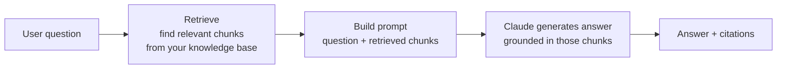

# 05 — Context Management and Reliability

> **Exam weight: 15%.**
> **Audience:** senior cybersecurity engineer, new to AI. Terms defined on first use; security analogies included.

---

## 0. Vocabulary

- **LLM:** the text-predicting model (Claude).
- **Prompt:** the text you send it.
- **Inference / a call:** one request-and-answer round-trip.

---

## 1. The context window and tokens

**Definition — Token:** the small unit of text the model reads and writes — roughly ¾ of a word (so ~750 words ≈ 1,000 tokens). Punctuation and spaces count too.

**Definition — Context window:** the **maximum amount of text (in tokens) the model can consider at once** — everything in the current request: system prompt + instructions + your data + the conversation so far + the model's answer. It's a hard size limit.

```
+--------------------- CONTEXT WINDOW (fixed token budget) ---------------------+
| system prompt | past conversation | your new question | model's answer (out)  |
+-------------------------------------------------------------------------------+
   If the total exceeds the window, the oldest/extra text must be dropped.
```

Key facts:
- The model has **no memory** outside this window. It doesn't "remember" earlier chats unless that text is re-supplied inside the window.
- Bigger context = more cost and more latency, and models can still **lose focus** in very long inputs.

> **Security analogy:** the context window is like a tool's **log buffer / ring buffer of fixed size**. Once it's full, old entries roll off. If the evidence you need isn't currently in the buffer, the analyst can't see it.

**Definition — "Lost in the middle" effect:** in a long input, the model reliably uses information placed at the **beginning** and the **end**, but may **overlook or omit** findings buried in the **middle**. Longer context does not mean the model weighs every part equally.

What to do about it:
- **Put the key findings / summary at the BEGINNING** of a long, aggregated input, and organize the rest with **explicit section headers** so important details are easy to locate.
- Don't assume that because a fact is "in the context" the model will use it — position matters.

> **Security analogy:** it's like a 300-page incident report where reviewers read the executive summary (front) and the conclusions (back) carefully but skim the middle. Put the critical IOCs up top, not buried on page 147.

---

## 2. Managing limited context

Techniques to fit big tasks into a small window:

**Summarization**
- Periodically compress old conversation/documents into a short summary and keep the summary instead of the raw text.
- **Analogy:** rolling up detailed logs into a daily summary to save space.

**Chunking**
- Split a large document into smaller pieces and process them one at a time (or in parallel), then combine.
- **Definition — Chunking:** breaking big input into bite-sized parts that each fit the window.

**Retrieval / RAG (fetch only what's relevant)**
- Instead of stuffing *everything* in, **retrieve just the few relevant pieces** for the current question and put only those in the prompt. (Full RAG below.)

> Rule of thumb: **put in only what's relevant.** More text isn't better — it's slower, costlier, and easier to distract.

**Summarization has a hidden RISK — losing critical facts.** Progressive summarization (repeatedly re-compressing a growing conversation) tends to squeeze **exact values into vague phrases**. A summary that says *"the customer discussed a refund and seemed unhappy about timing"* has quietly dropped the numbers that actually decide the case: the **amount ($482.15)**, the **order number (#10427)**, the **dates**, the **status**, and the **customer's stated expectation ("promised delivery by the 3rd")**. Once compressed away, those facts can't be recovered from the summary.

Techniques that protect the facts:
- **Case-facts block:** extract the hard transactional facts — **amounts, dates, order/ticket numbers, statuses, customer-stated expectations** — into a small, persistent **"case facts"** block and include it verbatim in **every** prompt, separate from the free-text summary. Summaries can drift; the facts block does not.
- **Structured issue-data layer for multi-issue sessions:** when one conversation covers several issues, keep a separate **structured record per issue** (id, status, key values) rather than blending everything into one prose summary.
- **Trim verbose tool outputs to only the relevant fields:** an order-lookup API may return **40+ fields**, but only ~5 (id, status, total, ship date, customer) matter for the task. Passing the whole blob wastes budget and buries the useful fields (the lost-in-the-middle risk). Keep the fields you need; drop the rest.
- **Structured hand-offs between agents:** when an upstream agent feeds a downstream agent with a **limited context budget**, have it return **structured data** (key facts, citations, relevance scores) instead of verbose raw content.

> **Security analogy:** summarizing raw logs into "some auth failures occurred overnight" loses the **source IPs, usernames, and timestamps** you need to act. Keep a structured facts table (who/what/when/how-many) alongside the narrative summary.

---

## 3. Memory across turns

Because the model is **stateless** (forgets between calls), "memory" is something *you* engineer:

- **Short-term memory:** the recent conversation you keep re-sending in the context window.
- **Long-term memory:** storing facts/notes outside the model (a file like `CLAUDE.md`, a database, a vector store) and pulling relevant bits back in when needed.

> **Analogy:** the model is an analyst with **no persistent notebook**. You hand them the relevant case notes at the start of each session; anything you don't hand over, they don't know.

---

## 4. Reducing hallucinations and grounding answers

**Definition — Hallucination:** when the model states something **false but confident** — invented facts, fake citations, made-up commands. It's guessing plausible text, not looking things up.

**Definition — Grounding:** tying the model's answer to **real, provided sources** (documents, tool results) so it isn't guessing.

Ways to reduce hallucination:
- **Provide the source material** and say *"answer only from the text below."*
- **Ask for citations/quotes:** "quote the exact line that supports each claim."
- **Give an out:** "if the answer isn't in the sources, say 'I don't know.'"
- **Use tools/RAG** to fetch facts instead of relying on memory.
- **Lower randomness** — see temperature below.

**Definition — Temperature:** a setting (0 to ~1) controlling randomness. **Low (near 0)** = focused, consistent, more factual. **High** = creative, varied. For security/factual work, keep it **low**.

> **Security analogy:** an ungrounded LLM is like an analyst writing a report **from memory** — confident but sometimes wrong. Grounding forces them to **cite the evidence**, like attaching the log lines to the incident report.

---

## 5. Evaluations (evals) — testing your LLM app

**Definition — Evaluation (eval):** a repeatable test that measures whether the model's outputs are good. Because LLMs are non-deterministic, you can't just "run it once and eyeball it" — you need systematic testing.

How to build evals:
1. **Build an eval set:** a collection of representative inputs plus the expected/ideal outputs (your "test cases").
2. **Run** your prompt/agent on the whole set.
3. **Judge the outputs.** Judging methods:
   - **Exact/rule-based:** does the output match, contain a keyword, or parse as valid JSON?
   - **Human review:** a person rates quality.
   - **LLM-as-judge:** another model grades the output against a rubric (fast, scalable; verify it's fair).
4. **Track a score over time** so you catch regressions when you change a prompt or model.

> **Security analogy:** evals are your **regression test suite / detection-rule unit tests**. Before shipping a new rule, you run it against known-good and known-bad samples to make sure you didn't break detection. Same discipline for prompts.

---

## 6. RAG (Retrieval-Augmented Generation) flow

**Definition — RAG:** a pattern where you **retrieve relevant documents first**, then give them to the model so it answers **from real, current data** instead of memory. This is the main way to give an LLM your private/up-to-date knowledge and to cut hallucinations.

**Definition — Embedding / vector store:** text is turned into numbers ("embeddings") that capture meaning; a **vector store** lets you find the chunks most *similar* to a question — that's the "retrieve" step.



ASCII version:

```
question --> [ RETRIEVE relevant docs ] --> [ stuff them into the prompt ]
                                                     |
                                                     v
                                     [ Claude answers using those docs ]
                                                     |
                                                     v
                                          grounded answer + citations
```

> **Analogy:** instead of the analyst answering from memory, they **first pull the exact relevant case files** from the archive, then write the answer citing those files. That's RAG.

---

## 7. Reliability patterns

Real systems must handle failure gracefully:

| Pattern | What it means | Security analogy |
|---|---|---|
| **Retry (with backoff)** | Try again after a transient failure, waiting longer each time | Retrying a flaky API/log source |
| **Fallback** | A backup path if the first fails (cached data, simpler model) | Failover to a secondary system |
| **Validation** | Check the output's format/values before trusting/using it | Schema validation on ingested events |
| **Guardrails** | Rules/filters limiting what the model can say or do | Allow-lists, content filters, WAF |
| **Human-in-the-loop** | Person approves risky actions | Change-approval / break-glass |
| **Timeouts & limits** | Cap loops, tokens, cost, time | Rate limiting, circuit breakers |

**Definition — Guardrail:** a rule or filter that constrains model behavior (e.g., block certain content, require valid JSON, refuse out-of-scope requests).

---

## 7a. Escalation and ambiguity resolution

When an agent handles real requests (support, triage, operations), part of reliability is **knowing when to stop and hand off to a human**, and how to react when the request is unclear.

**Definition — Escalation:** deliberately routing a case to a human (or a higher-authority path) instead of the agent resolving it.

**Escalate when any of these TRIGGERS occur:**
- The **customer explicitly asks for a human.** Honor this **immediately** — do **not** investigate the issue first or try one more time. An explicit human request is itself the trigger.
- A **policy exception or gap** — the situation isn't covered by policy, or requires bending it.
- The agent **cannot make meaningful progress** (missing data, repeated dead ends, an action it isn't allowed to take).
- **Policy is ambiguous or silent** on the situation — e.g., policy covers price-matching **your own site** but the customer is asking about **matching a competitor's price**. Silence ≠ permission; escalate.

**Handling frustration correctly:**
- If the issue **is within the agent's capability**, **acknowledge the frustration while still offering the resolution** (don't dump it to a human just because the tone is negative). Escalate **only if the customer reiterates** that they want a person.
- **Sentiment is NOT a reliable trigger.** A frustrated tone doesn't mean the case is complex, and a calm tone doesn't mean it's simple. **Self-reported confidence scores** ("I'm 90% sure") are likewise **unreliable proxies for actual complexity** — don't route on vibe or on the model's own confidence.

**Ambiguity / identity resolution:**
- If a lookup returns **multiple customer matches**, **ask for another identifier** (email, order number, ZIP) — **do not guess** which record is right. Acting on the wrong record is worse than a small delay.

**How to build this in:** put **explicit escalation criteria with few-shot examples** into the system prompt (e.g., show a "customer asks for a human → escalate immediately" example, and a "frustrated but resolvable → acknowledge + resolve" example). Clear criteria beat leaving the model to improvise.

> **Security analogy:** it's the **break-glass / on-call escalation runbook**. Certain conditions (explicit request, out-of-policy action, no progress) mean **page a human now** — you don't keep poking at a P1 alone, and you don't decide severity by how panicked the reporter *sounds*.

---

## 7b. Error propagation across multi-agent systems

In a multi-agent system a **coordinator** delegates to **subagents**. How subagents report failure decides whether the whole system degrades gracefully or falls over.

**Definition — Structured error context:** when a step fails, returning a machine-usable description of the failure — **failure type, the query/action attempted, any partial results, and suggested alternative approaches** — instead of a bare "it failed."

Do:
- **Return structured error context** so the coordinator can **recover intelligently** (retry differently, try another source, or work with the partial results).
- **Distinguish an access failure from a valid empty result.** A **timeout / connection error** is an access failure that may warrant a **retry decision**; a search that ran fine and simply **found nothing** is a legitimate answer, not an error. Treating "0 results" as a crash (or a crash as "0 results") both mislead the coordinator.
- **Do local recovery for transient failures.** A subagent should retry small, transient problems itself and only **propagate what it genuinely can't resolve**.
- **Annotate synthesis output with COVERAGE annotations** — mark which findings are **well-supported** and which **areas have gaps** — so the coordinator knows what's solid vs. missing.

Don't (anti-patterns):
- **Silently suppressing errors** (swallowing them so the coordinator thinks all is well).
- **Terminating the entire workflow on a single subagent failure** (one flaky source shouldn't kill the whole job).
- **Generic status messages** like "search unavailable" that **hide the valuable context** (which query, which source, was it a timeout or empty?).

> **Security analogy:** a SIEM pipeline where one log source is down. A good collector reports *"source X timed out after 3 retries; last good pull 09:14; other sources OK"* (structured, recoverable) — it does **not** silently drop the source or halt the entire pipeline, and it doesn't just say "ingest failed."

---

## 8. Cost and latency management

- **Fewer/shorter calls** = cheaper and faster. Trim the prompt to what's relevant.
- **Right-size the model:** use a smaller, cheaper model for easy steps; a stronger one only where needed.
- **Cache** repeated context so you don't resend/re-pay for the same big blocks.
- **Parallelize** independent work to cut wall-clock time (but total token cost stays).
- **Watch the loop count** in agents — each loop is another paid call.

> **[Free-tier note]** Free tier has limited usage. These cost patterns matter most at paid scale, but understanding **why** they exist is exam material. Study the concepts; you don't need to run large workloads.

---

## 8a. Context in large codebase exploration

When an agent works through a **large codebase** over a long session, context management becomes the main reliability problem.

**Definition — Context degradation:** as a long session fills the window, the model's answers get **inconsistent** — it starts referencing *"typical patterns"* or generic advice **instead of the specific classes, files, and decisions it actually discovered earlier** in the same session. Earlier findings have effectively rolled out of usable context.

Ways to keep long explorations reliable:
- **Scratchpad files:** persist key findings (file map, important classes, decisions, TODOs) to a **scratchpad file** so they survive across **context boundaries** — the agent re-reads the scratchpad instead of relying on fading memory.
- **Subagent delegation:** hand the **verbose exploration** of a sub-area to a **subagent**, which reads a lot but returns only a compact summary — that **isolates** the noisy detail from the main agent's context.
- **Summarize before spawning the next phase:** before launching the next phase's subagents, **summarize the key findings** so each new subagent starts from a tight, accurate brief.
- **Structured state persistence for crash recovery:** have **each agent export its state to a known location**, and have the **coordinator load a manifest on resume**. If a long run crashes, work resumes from the manifest instead of starting over.
- **`/compact`:** use the **`/compact`** command to **reduce context usage** during long sessions (it condenses the running conversation so there's room to keep going).

> **Security analogy:** it's like a long forensic investigation. You keep a **case file / evidence log** (scratchpad + manifest) on disk, hand off sub-investigations to specialists who report back summaries, and checkpoint state so a crash doesn't lose the whole chain of custody.

---

## 8b. Human review workflows & confidence calibration

When AI extracts or classifies data at scale (documents, forms, tickets), you decide **how much to automate vs. send to a human**. Doing that safely depends on **honest, segmented accuracy measurement**.

**Aggregate accuracy can LIE.** A headline number like **"97% accurate overall"** can **mask poor performance** on a specific **document type** or a specific **field**. The average looks great while one category (say, handwritten forms, or the "tax ID" field) quietly fails much more often.

Measure and route correctly:
- **Validate accuracy BY document type and by field/segment BEFORE automating** or reducing human review — not just in aggregate.
- **Stratified random sampling:** to see whether "high-confidence" extractions are truly reliable, take a **random sample within each stratum** (each document type / confidence band) and measure the **error rate** there. This catches a high-confidence category that's secretly wrong.
- **Definition — Stratified random sampling:** dividing items into groups (strata) and sampling randomly within each group, so **every group is measured** instead of being drowned out by the biggest group.
- **Calibrate field-level confidence scores using labeled validation sets** — a raw model "confidence" only means something once you've checked it against known-correct labels.
- **Route to human review** the **low-confidence** extractions and any where **sources are ambiguous or contradictory**.

> **Security analogy:** a detector at "99% accurate" can still miss the one attack class that matters. You **stratify by alert type** and sample each — because an average hides the category that's silently failing.

---

## 8c. Information provenance & uncertainty in multi-source synthesis

When an agent **synthesizes one answer from many sources**, the biggest risk is that **where each fact came from gets lost** during compression.

**Definition — Provenance (source attribution):** the record of **which source each claim came from** (URL, document name, the exact excerpt). Provenance is easily **lost during summarization** — as findings are compressed, the "who said this" gets dropped and every claim starts to look equally authoritative.

Preserve provenance and represent uncertainty honestly:
- **Require structured claim-source mappings:** each finding carries its **source URL / document name and the relevant excerpt**, and the **synthesis step must preserve and merge** those mappings — not flatten them into unattributed prose.
- **Handle conflicting sources by ANNOTATING the conflict, not picking one.** When two credible sources give **different statistics**, present **both with their source attribution** ("Source A: 12%; Source B: 18%") rather than **arbitrarily choosing** one value.
- **Require dates (temporal data):** include **publication / collection dates** in the structured output, so readers can weigh **how current** each figure is.
- **Distinguish well-established findings from contested ones** in the report's structure — don't present a hotly-debated number with the same confidence as a settled fact.
- **Render each content type appropriately:** **financial data as tables**, **news as prose**, **technical findings as structured lists** — rather than forcing everything into one uniform format.

> **Security analogy:** it's threat-intel fusion. You keep **source attribution and the collection date** on every indicator, and when two feeds **disagree** you report the disagreement with sources — you don't silently pick one number and strip the citation.

---

## 9. Responsible / safe deployment basics

- **Don't send secrets or sensitive PII** into prompts unless you control and trust the data path.
- **Keep a human in the loop** for consequential actions.
- **Log and audit** what the system does (prompts, tool calls, outputs).
- **Set guardrails** for harmful, off-scope, or unsafe outputs.
- **Test with evals before and after changes**, and monitor in production.
- **Be transparent** that answers come from an AI and can be wrong — verify before acting.

> **Security analogy:** ship an AI feature the way you'd ship a privileged automation — least privilege, logging, approvals, testing, and monitoring. AI safety and operational security rhyme.

---

## Verify latest
These areas evolve. Confirm current details at:
- **Anthropic / Claude docs:** docs.anthropic.com and docs.claude.com — context windows, evals, reducing hallucinations, prompt caching, safety.
- **MCP docs:** modelcontextprotocol.io (for tool/retrieval connections).
Re-check especially: current context-window sizes, caching features, and evaluation tooling.

---

## ✅ Check your understanding
When you finish, tell your tutor AI. **It will ask 5–10 multiple-choice questions, one at a time**, on: tokens and the context window, the lost-in-the-middle effect, managing limited context (summarization/chunking/retrieval) and its fact-loss risks (case-facts block, trimming tool outputs), memory across turns, hallucinations and grounding, temperature, evals (building sets + judging), RAG flow, reliability patterns (retry/fallback/validation/guardrails), escalation & ambiguity resolution, error propagation across multi-agent systems, large-codebase context (scratchpad/manifest//compact), human review & confidence calibration (stratified sampling), provenance & multi-source synthesis, and cost/latency. One question at a time, with feedback.

**Sample checkpoint questions on the newer material:**

1. A support agent has been chatting with a customer for 30 turns; the running summary now reads *"customer is unhappy about a delayed refund."* The agent needs to process the refund but the exact amount, order number, and promised date are gone. What practice would have PREVENTED this?
   - A. Use a larger context window so nothing is dropped.
   - B. Maintain a persistent **"case facts" block** (amount, order #, dates, status, customer-stated expectations) included in every prompt, separate from the prose summary. ✅
   - C. Lower the temperature to 0.
   - D. Ask the customer to repeat everything each turn.
   *Why:* progressive summarization compresses exact values into vague phrases; a structured facts block keeps the transactional details that summaries lose.

2. A frustrated customer types: *"This is ridiculous — just get me a human."* The issue is one the agent could resolve. What's the correct action?
   - A. Try to resolve it first; only escalate if resolution fails.
   - B. Run a sentiment check and escalate because the tone is negative.
   - C. **Escalate to a human immediately** — an explicit request for a human is itself the trigger; don't investigate first. ✅
   - D. Ask the model for its confidence score and escalate if it's below 90%.
   *Why:* honor an explicit human request immediately; sentiment and self-reported confidence are unreliable proxies for whether to escalate.

3. In a multi-agent research system, a subagent's search API times out. What should it return to the coordinator?
   - A. A generic "search unavailable" message.
   - B. Nothing — silently drop the failure so the workflow isn't disturbed.
   - C. Terminate the entire workflow.
   - D. **Structured error context** — failure type (timeout vs. empty result), the attempted query, any partial results, and alternative approaches — after attempting local retry for the transient failure. ✅
   *Why:* structured error context lets the coordinator recover intelligently; silent suppression, generic statuses, and killing the whole workflow are anti-patterns, and a timeout (access failure) is different from a valid empty result.

4. An extraction pipeline reports **97% overall accuracy**, so the team wants to drop human review. What's the right check before automating?
   - A. Trust the aggregate — 97% is high enough.
   - B. **Validate accuracy by document type and by field, using stratified random sampling** (including within high-confidence extractions) before reducing review. ✅
   - C. Raise the model's temperature to improve coverage.
   - D. Only review the documents the model flags as low-confidence and ignore the rest.
   *Why:* an aggregate number can mask poor performance on a specific type or field; stratified sampling measures each segment so a silently-failing category is caught.
